# *CyberGuard: AI-Powered Cybersecurity Chatbot*

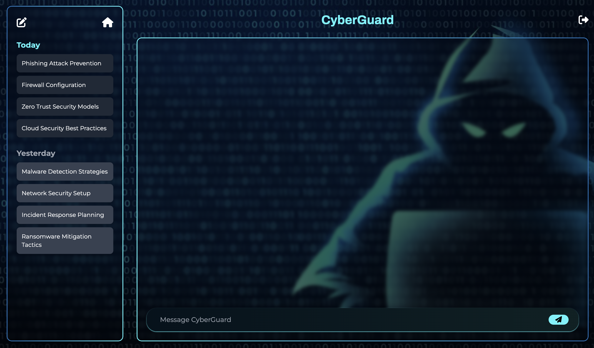  

## 📄 *Submission Details*  
- *Title:* CyberGuard: Combining Diffusion Models and Language Understanding Models in a Cybersecurity Chatbot with Advanced Retrieval-Augmented Generation (RAG) Using a Microservices Architecture in a DevOps/MLOps Context  
- *Submission Date:* 2024-01-14  
- *Professor:* EL AACHAK Lotfi  
- *Master's Program:* Cybersecurity and Big Data (Second Year)  
- *Module:* Deep Learning  
- *Team Members:*  
  - AKZOUN Hafsa  
  - BOULBEN Firdaous  
  - EL HAYANI Adnan  
  - EL YAHYAOUY Imane  
  - TOUYEB Zakaria
### 📂 *Repository Links*  
- *Frontend:* [CyberGuard Frontend](https://github.com/firdaous-boulben/CyberGuard.git)  
- *Backend (Spring Boot):* [ChatBot Security](https://github.com/hafsakzoun/ChatBoot-security.git)  
- *RAG Model:* [Chatbot RAG](https://github.com/adnanelhayani/chatbot_rag.git)  
- *Diffusion Model:* - [Network Flow Analysis and Threat Diffusion Simulation](https://github.com/ELYAHYAOUY-FL/Diffusion_Prediction_Service.git)
                     - [tram_generator](https://github.com/Zakaria1298727/framegenerator/tree/master) 

---

## 📚 *Table of Contents*  
1. [Introduction](#chapter-1-introduction)  
2. [Retrieval-Augmented Generation (RAG) Model](#chapter-2-retrieval-augmented-generation-rag-model)  
3. [Diffusion Model for Threat Forecasting](#chapter-3-diffusion-model-for-threat-forecasting)  
4. [System Implementation](#chapter-4-system-implementation)  
5. [Testing and Evaluation](#chapter-5-testing-and-evaluation)  
6. [Conclusion](#chapter-6-conclusion)  

---

## 📖 *Chapter 1: Introduction*  
Cybersecurity threats are evolving rapidly, requiring adaptive and intelligent defense mechanisms. *CyberGuard* addresses this need by integrating *Language Understanding Models (LUM), **Diffusion Models* for threat forecasting, and *Retrieval-Augmented Generation (RAG)* to deliver real-time, context-aware cybersecurity insights. Designed with a *microservices architecture* and deployed using *DevOps/MLOps practices*, CyberGuard ensures scalability, maintainability, and rapid deployment.

### 🎯 *Objectives*  
- *Develop a Cybersecurity Chatbot:* Provide intelligent, real-time responses to cybersecurity queries.  
- *Implement Diffusion Models:* Predict the spread of cybersecurity threats in network environments.  
- *Leverage LUM:* Use models like *Google Gemini Pro* for accurate understanding of user inputs.  
- *Enhance Responses with RAG:* Combine data retrieval and AI generation for context-rich answers.  
- *Adopt Microservices Architecture:* Ensure modularity and scalability.  
- *Integrate DevOps/MLOps Practices:* Enable CI/CD, model management, and automation.

---

## 🤖 *Chapter 2: Retrieval-Augmented Generation (RAG) Model*  

### 📌 *Overview*  
The RAG microservice uses *Google Generative AI (Gemini Pro)* for advanced natural language understanding and integrates a document retrieval system for precise, context-aware answers. It is built using *Flask* and *MongoDB* as part of the larger CyberGuard system.

### 🔑 *Key Features*  
- *RAG Model:* Combines AI-generated responses with real-time document retrieval for accuracy.  
- *Google Generative AI Integration:* Leverages *Gemini Pro* for natural language comprehension.  
- *PDF Knowledge Base:* Loads and processes cybersecurity PDFs for knowledge-rich answers.  
- *Vector Database (Chroma):* Efficient document indexing and retrieval.  
- *MongoDB Integration:* Stores user interactions for seamless session continuity.  
- *REST API with CORS:* Enables secure communication with the Angular frontend.  

### 🛠 *Technology Stack*  
- *Backend:* Python, Flask  
- *AI Models:* Google Generative AI (Gemini Pro)  
- *Vector Database:* Chroma  
- *Database:* MongoDB  

### 🏗 *Project Architecture*  

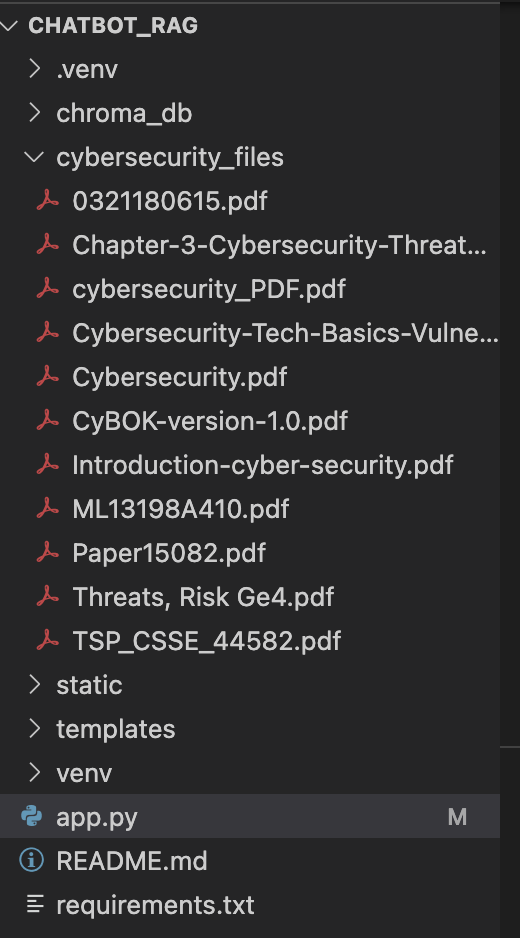  
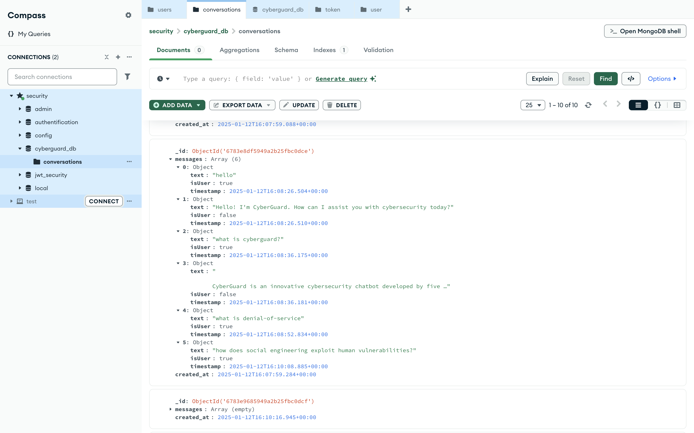  

---

### 🚀 *How It Works*  
1. *PDF Processing:* Loads and splits cybersecurity PDFs into searchable chunks.  
2. *Data Embedding:* Uses *Google Generative AI embeddings* to encode the data.  
3. *Query Handling:* RAG model generates accurate, context-aware responses.  
4. *User Interaction:* REST API endpoints enable chatbot communication with the frontend.  

---

### 📡 *API Endpoints*  
- **POST /ask**: Accepts user queries and returns AI-generated answers with source references.  

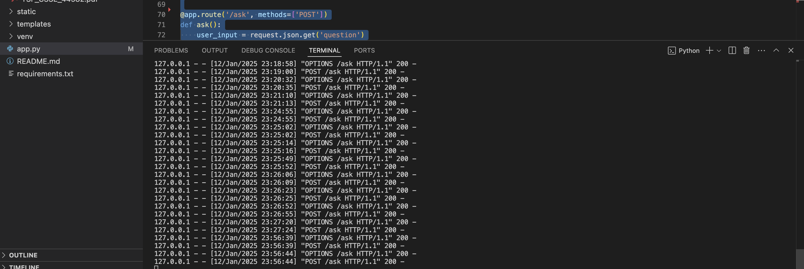  

---

## 🔮 *Chapter 3: Diffusion Model for Threat Forecasting*  

### 📌 *Overview*  
The *Diffusion Model* predicts and visualizes how cybersecurity threats spread across a network, helping identify vulnerable nodes and enabling proactive defense mechanisms. It provides a critical layer of foresight, allowing administrators to respond to potential breaches before they escalate.

### 🛠 *Implementation*  
The Diffusion Model is implemented as a Python-based microservice and uses graph-based simulation to model threat propagation.

- **Language:** Python  
- **Framework:** Flask  
- **Visualization Library:** NetworkX, Matplotlib  

### 🔑 *Features*  
- **Threat Simulation:** Models the spread of cybersecurity threats across network nodes.  
- **Impact Analysis:** Highlights affected nodes (orange), uninfected nodes (blue), and the targeted IP (red).  
- **Visualization:** Generates intuitive graphs to represent threat diffusion.  
- **Proactive Defense:** Provides early detection and prioritization of high-risk areas.  

### 📂 *Architecture*   
1. **Final_model_diffusion.ipynb:** A Jupyter Notebook for preprocessing data, generating data using the diffusion model, and preparing it for classification. This includes training and classification using the RandomForestClassifier to determine whether nodes are affected or not.  
2. **App.py:** A backend file that uses the model to provide an interface for testing an IP input within the network and simulating the spread of the threat.  
3. **frame_generator:** Training and implementation of the diffusion model to generate frames for simulation. 

 
### 🚀 *How It Works*  
1. **Data Input:** Network flow data is processed to construct a graph of connected devices.  
2. **Graph Simulation:** Threat diffusion is modeled using probabilistic algorithms, simulating how malware or attacks propagate.  
3. **Visualization:** Graphs are generated to highlight the status of each node (infected, uninfected, or target).  
4. **Output:** Predictions and visualizations are displayed in the *Diffusion Model Interface*.  

###  *Graphical Representation*  
Below is an example graph illustrating the diffusion model's output. Nodes are color-coded to reflect their status in the network.  

---

###  *API Endpoints*  
  - `/test_ip` (POST): Accepts a JSON payload with the IP address to test and returns impact analysis results, including the path to the visualization graph.

---

### *Integration with CyberGuard*  
The Diffusion Model integrates seamlessly into the *CyberGuard* system, contributing to:  
- **Threat Prediction:** Displays risk zones on the network.  
- **Incident Response:** Suggests targeted actions for high-risk areas.  
- **User Interface:** The Angular frontend displays diffusion results with interactive visualizations.  

---

## 💻 *Chapter 4: System Implementation*  

### 🔙 *Backend Development*  
- *Spring Boot:* Handles user authentication and registration using *JWT*.  
  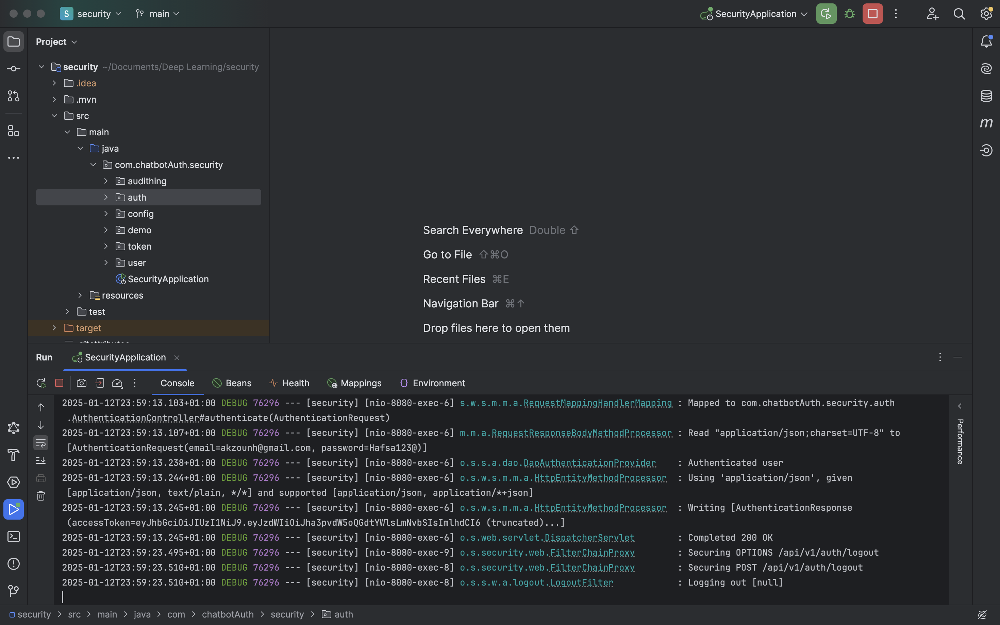  
- *Postman:* API testing for authentication.  
  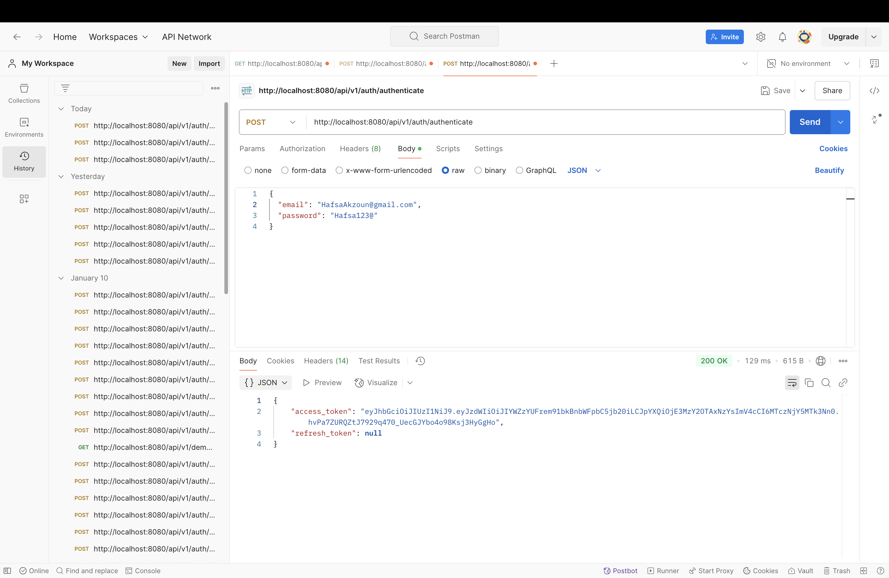  
- *MongoDB:* Stores user data and session information.  
  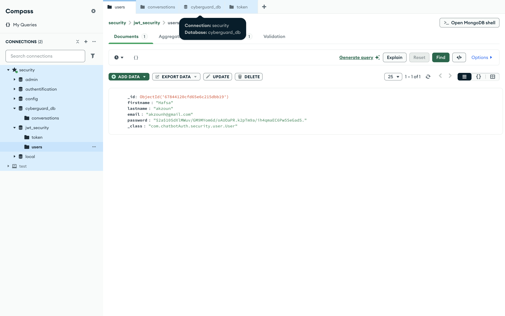  
- *Flask:* Hosts Python microservices for *RAG* and *Diffusion Models*.  

### 🌐 *Frontend Development*  
- *Angular:* Provides an interactive UI for seamless user interaction.  
  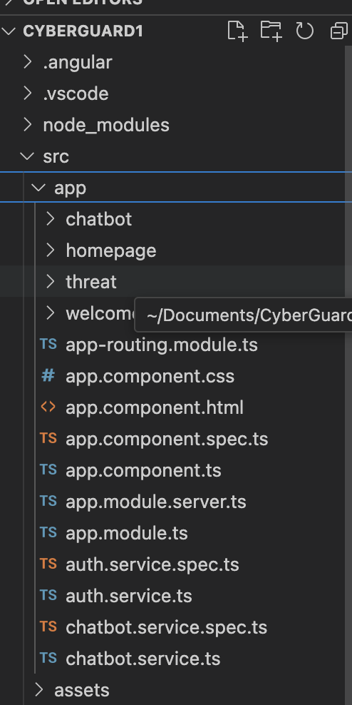  

- *User Registration:*  
  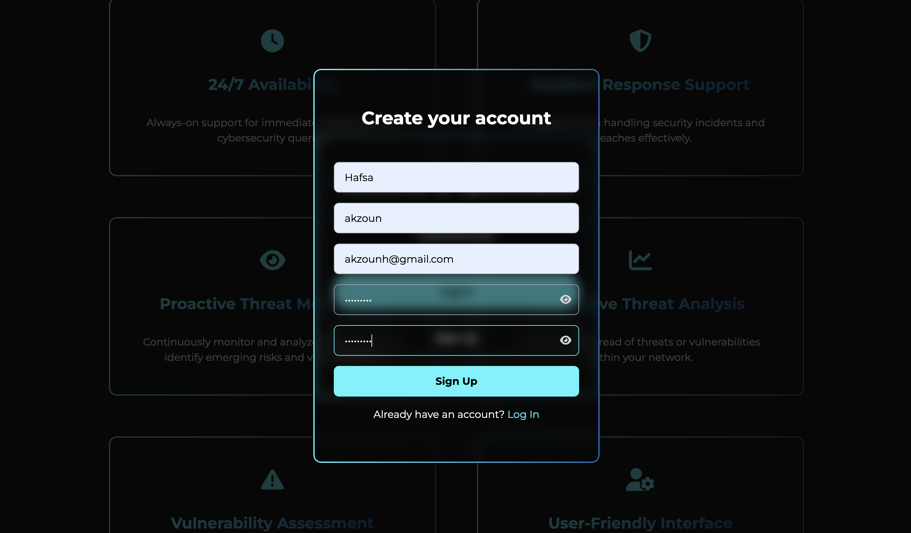  

- *User Login:*  
  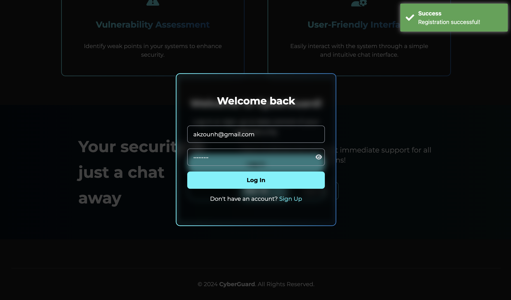  
  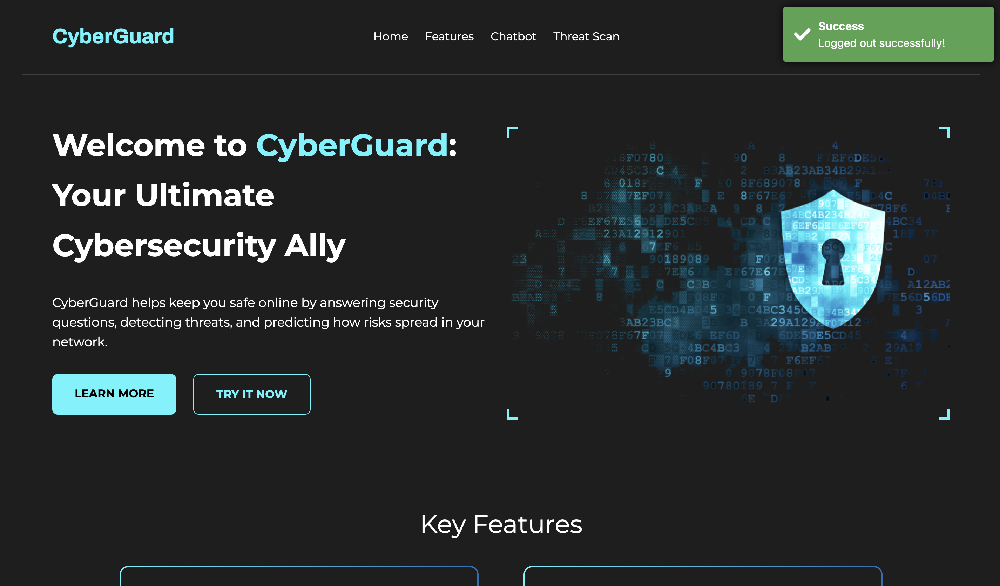  

- *Homepage:*  
  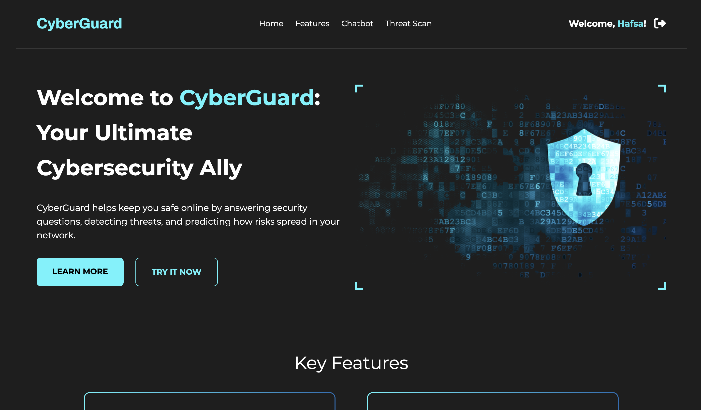  

- *ChatBot Interface:*  
  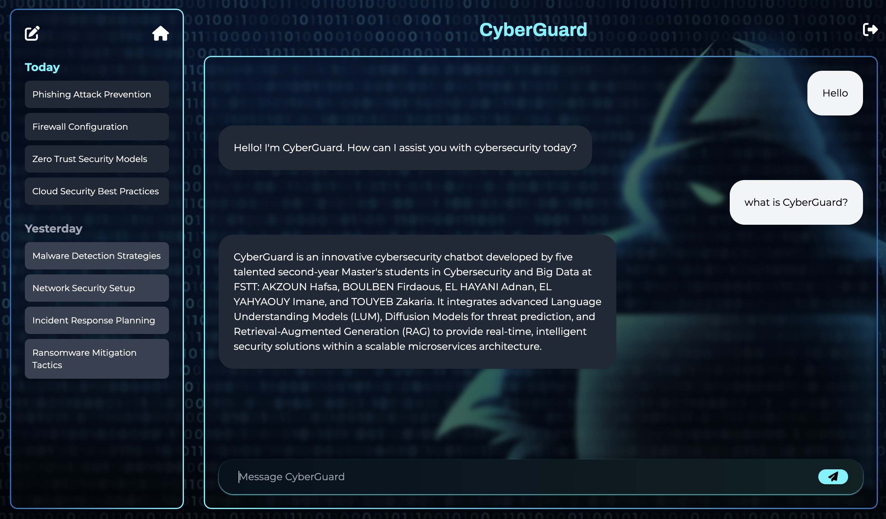  
  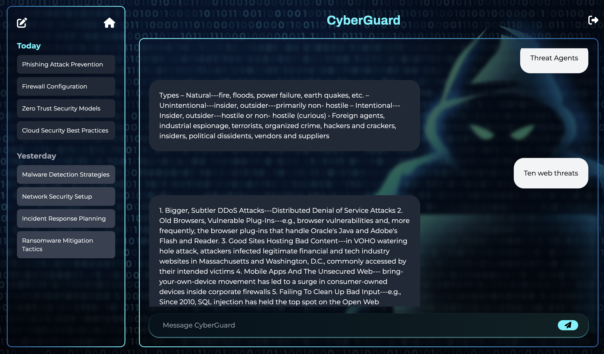  

- *Diffusion Model Interface:*  
    

---

### ⚙ *DevOps/MLOps Integration*  
- *CI/CD Pipelines:* Automated testing and deployment with *GitHub Actions*.  
- *Docker:* Containerization for microservice isolation.  
- *Kubernetes:* Service orchestration for scalability.  

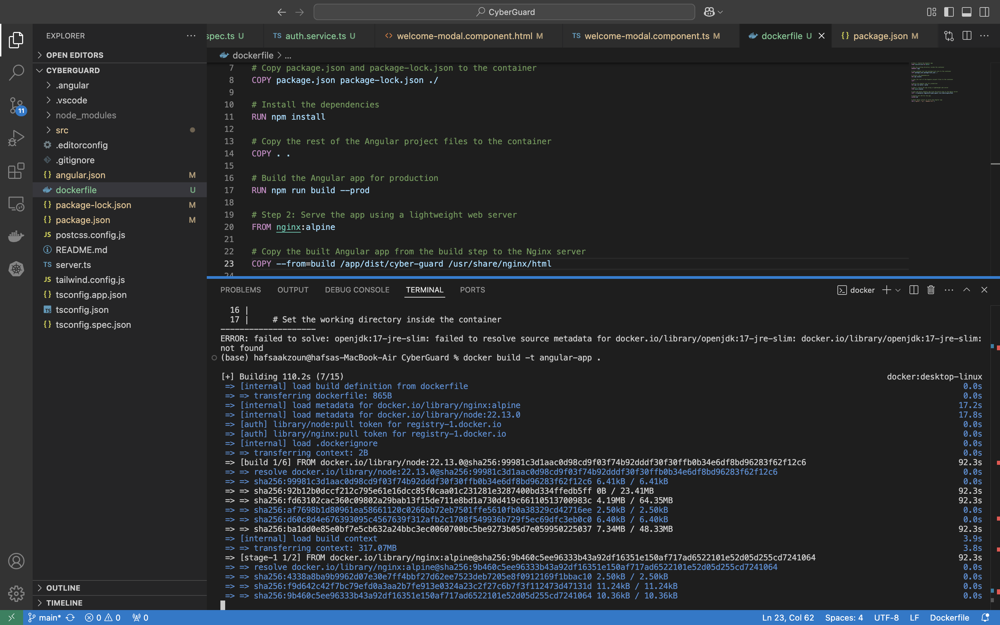  
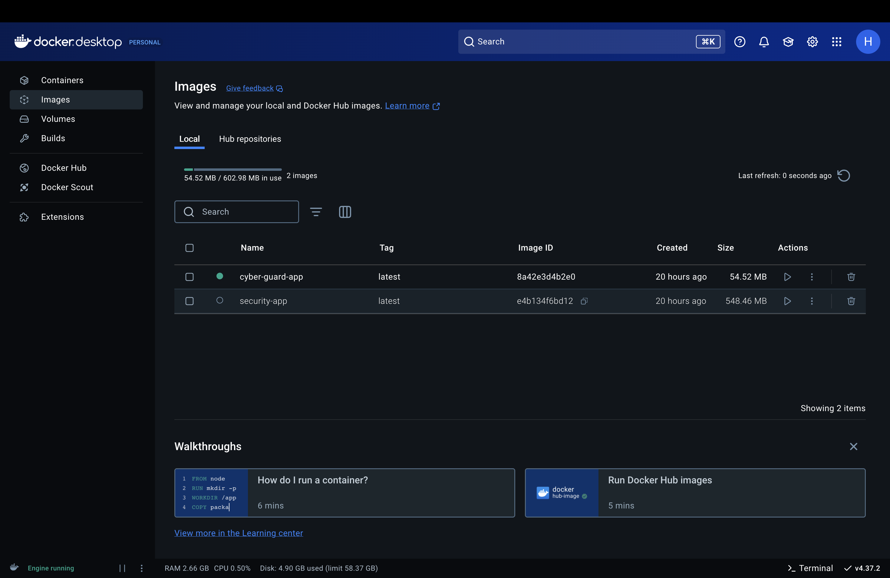  

---
### 🛠 *Setup Instructions*  
1. *Clone the Repositories:*  
   bash
   git clone <frontend-repo>
   git clone <backend-repo>
   git clone <rag-repo>
     
2. *Build Docker Containers:*  
   bash
   docker-compose up --build
     
3. *Deploy Kubernetes Cluster:*  
   bash
   kubectl apply -f k8s/
     
4. *Access the UI:* Open http://localhost:4200 in your browser.

---

## 🧪 *Chapter 5: Testing and Evaluation*  
- *Functional Testing:* Verifies individual services work as expected.  
- *Integration Testing:* Ensures seamless interaction between services.  
- *Performance Testing:* Assesses system scalability and response time.  
- *Threat Prediction Accuracy:* Evaluates the effectiveness of the diffusion model.

---

## ✅ *Chapter 6: Conclusion*  
*CyberGuard* successfully integrates *Language Understanding Models, **Diffusion Models, and **RAG* to deliver intelligent cybersecurity solutions. Its microservices architecture ensures scalability, and DevOps/MLOps practices streamline deployment. Future improvements could include expanding data sources, refining diffusion algorithms, and enhancing real-time incident response.

---

## 🤝 *Contribution*  
We welcome contributions through issues and pull requests.

## 📄 *License*  
[MIT License](LICENSE)

---
